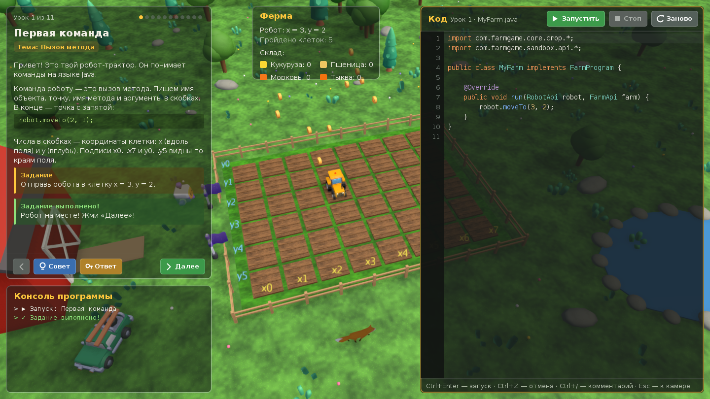

# Java Farm

Обучающая 3D-игра про ферму: игрок управляет роботом-трактором, **программируя его на Java**.
По ходу игры осваиваются ООП, инкапсуляция, интерфейсы/API, паттерны Builder, Command, Facade и т.д.



## Быстрый старт

Требуется **JDK 21+** (именно JDK, не JRE: игра компилирует код игрока через `javax.tools`).
Gradle ставить не нужно — используется wrapper.

```bash
./gradlew build                                   # сборка + тесты
./gradlew :engine:run                             # запуск 3D-окна
./gradlew :engine:run --args="--quality=low"      # для слабых компьютеров
```

На Windows: `gradlew.bat build` и `gradlew.bat :engine:run`.

📖 **Подробная инструкция** — установка JDK на Windows/macOS/Linux, запуск из IntelliJ IDEA,
параметры, управление и решение проблем: [docs/RUNNING.md](docs/RUNNING.md).

После запуска откроется окно 1280×720: ферма 8×6 грядок с забором, амбаром, прудом и деревьями,
робот-трактор и интерфейс. Сразу стартует демо-программа игрока
(`engine/src/main/resources/programs/DemoFarm.java`): робот сажает ряд культур, поливает,
ждёт урожая и собирает его три сезона подряд.

**Управление:** мышь (зажать) — вращать камеру, колесо — зум, `WASD` — сдвиг,
`Q`/`E` — поворот, `F` — следить за роботом, `R` — сброс камеры, `G` — сетка, `H` — интерфейс, `Esc` — выход.

### Графика

Вся сцена собрана из примитивов jMonkeyEngine — без внешних моделей и текстур:
градиентное небо, мягкие тени от солнца, SSAO, bloom, FXAA; у каждой культуры своя модель
и стадии роста; у трактора крутятся колёса и мигает маячок; полив, посадка и сбор урожая
сопровождаются частицами. Интерфейс рисуется через Java2D, поэтому поддерживает кириллицу.
Уровень качества — `--quality=low|medium|high`.

## Архитектура

```
engine  ──►  sandbox  ──►  core
(jME3)       (API игрока,   (логика фермы,
              компилятор)    без графики)
```

| Модуль    | Пакет                  | Назначение |
|-----------|------------------------|------------|
| `core`    | `com.farmgame.core`    | Ферма, грядки, культуры (`Crop` + Builder), робот, склад. Чистая Java, покрыта тестами. |
| `sandbox` | `com.farmgame.sandbox` | Публичный API игрока (`api`), команды робота (`command`), компиляция в памяти (`compiler`), запуск с таймаутом (`runtime`). |
| `engine`  | `com.farmgame.engine`  | `Main`, 3D-сцена из примитивов и пост-эффекты (`scene`), синхронизация логики и графики, камера, частицы (`state`), HUD на Java2D (`ui`), запуск программ (`program`). |

### Как код игрока попадает в игру

1. Исходник компилируется в памяти — `PlayerCodeCompiler` → `CompilationResult` (`Success` / `Failure` с номерами строк).
2. Классы загружаются через `SandboxClassLoader` — доступны только `java.lang`, `java.util`,
   `com.farmgame.sandbox.api` и `com.farmgame.core.crop` (без рефлексии, потоков, `System`, `java.io`).
3. `ProgramRunner` запускает программу в отдельном потоке с лимитом времени.
4. Вызовы `robot.moveTo(x, y)` превращаются в команды (`RobotCommand`) и попадают в `QueuedCommandSink`.
   Игровой цикл (`RobotCommandState`) применяет их к логике фермы, проигрывает анимацию —
   и только тогда метод игрока возвращает управление.

### Пример программы игрока

```java
import com.farmgame.core.crop.*;
import com.farmgame.sandbox.api.*;

public class MyFarm implements FarmProgram {
    @Override
    public void run(RobotApi robot, FarmApi farm) {
        robot.moveTo(2, 3);
        robot.plant(Crop.builder()
                .setType(CropType.CORN)
                .setFertilized(true)
                .build());
        robot.water();
        while (!farm.isRipe(2, 3)) {
            robot.pause(1.0);
        }
        robot.say("Собрано: " + robot.harvest());
    }
}
```

## Дальнейшие шаги

- Внутриигровой редактор кода (сейчас запускается встроенная демо-программа).
- Система уроков/заданий, открывающих новые части API (поливалки, сборщики, несколько роботов).
- Изоляция кода игрока в отдельном процессе — `SandboxClassLoader` пока учебный барьер, а не граница безопасности.
